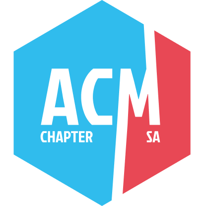

  

<h1 align="center">ACM San Antonio</h1>

  A community for computing, connection, and growing the San Antonio tech scene.

  <a href="https://acmsa.org/">Website</a> |
  <a href="https://www.linkedin.com/company/acm-san-antonio">LinkedIn</a> |
  <a href="https://www.meetup.com/acm-sa/">Meetup</a> |
  <a href="https://www.instagram.com/acmsanantonio/">Instagram</a> |
  <a href="https://discord.gg/t94zZC3Ktm">Discord</a>

  
  
  

## Purpose

The Association for Computing Machinery San Antonio Chapter exists to help in cultivating a thriving and professional community where engineers, scholars, and those looking to learn can connect, collaborate, and elevate San Antonio’s tech ecosystem.
## This GitHub organization

This organization is used to host and maintain the **ACM San Antonio website**, support future chapter infrastructure, and eventually organize content and materials from speakers and community contributors.
